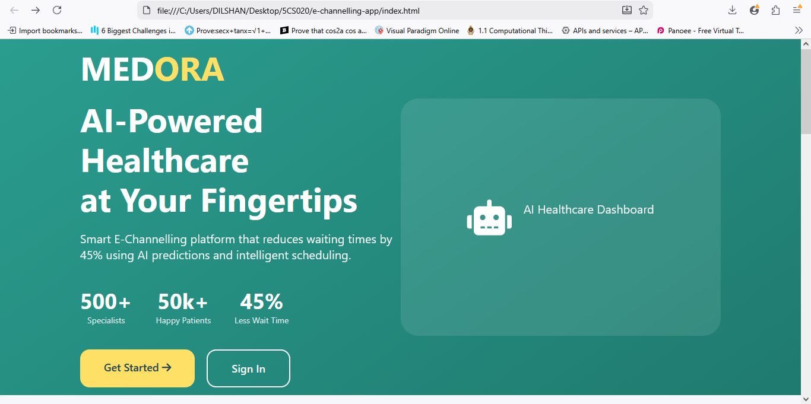
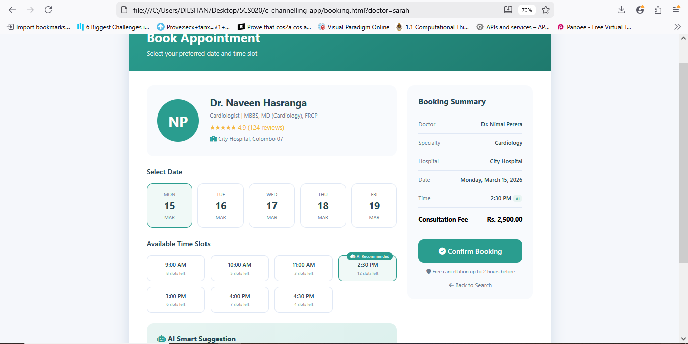
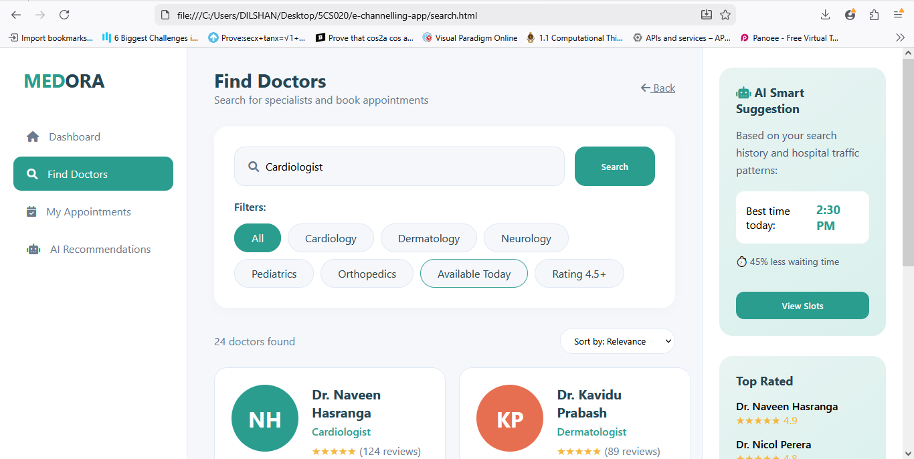
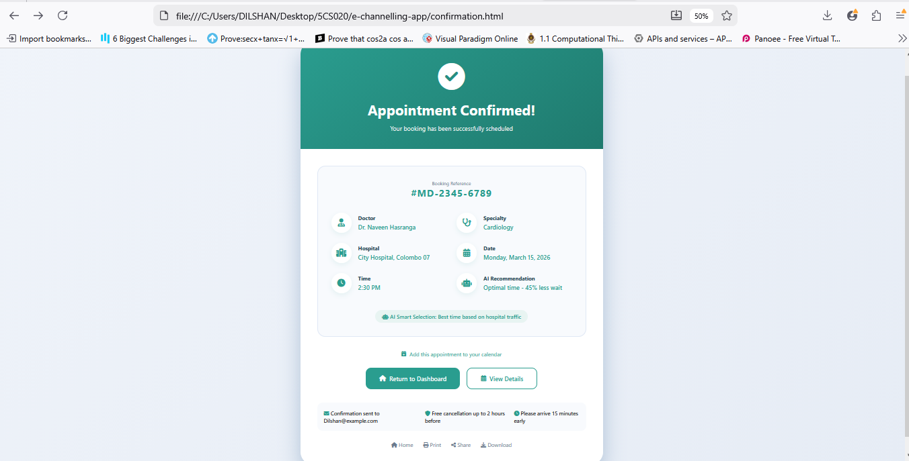

# Medora - AI-Powered E-Channelling Platform 🏥🤖



## 📋 Project Overview

**Medora** is a modern, AI-enhanced e-channelling platform designed to transform how patients book medical appointments in Sri Lanka. This prototype demonstrates how Artificial Intelligence can reduce waiting times, optimize scheduling, and improve the overall patient experience.

This project was developed as part of the **BSc(Hons) Computer Science - 5CS020 Human-Computer Interaction** module, addressing real-world challenges in Sri Lanka's healthcare sector.

## ✨ Key Features

### 🧠 AI-Powered Smart Suggestions
- **Optimal Time Recommendations**: AI analyzes hospital traffic patterns to suggest the best appointment times
- **Wait Time Predictions**: Real-time estimates showing "45% less wait" for AI-recommended slots
- **Historical Data Analysis**: Leverages past behavior to predict patient flow

### 👨‍⚕️ Comprehensive Doctor Discovery
- Search by specialty, name, or hospital
- Filter by cardiology, neurology, dermatology, and more
- View doctor ratings, reviews, and availability

### 📅 Seamless Booking Experience
- Interactive date and time slot selection
- AI-badged recommended slots
- Real-time availability counters
- Booking summary with consultation fees

### 📱 Complete User Journey
| Page | Purpose |
|------|---------|
| `index.html` | Landing page with platform overview |
| `login.html` | User authentication interface |
| `home.html` | Personalized dashboard with stats |
| `search.html` | Doctor discovery with AI sidebar |
| `booking.html` | Appointment scheduling with AI suggestions |
| `confirmation.html` | Booking confirmation with details |

## 🎨 Design Philosophy

- **User-Centered Design**: Intuitive navigation and clear visual hierarchy
- **Consistent Branding**: Teal (#2a9d8f) primary color throughout
- **Accessibility**: High contrast, readable fonts, and hover states
- **Responsive Layouts**: Grid-based designs that work on desktop

## 🛠️ Technologies Used

- HTML5
- CSS3 (Flexbox, Grid, Animations)
- Font Awesome 6.0 Icons
- Modern CSS Features (Variables, Gradients, Transitions)

## 📊 Project Documentation

- [Client Requirements Document](docs/client-requirements.docx)
- [Testing Results (Unit, Integration, System)](docs/testing-results.docx)

## 🎯 Addressing Real-World Challenges

This project specifically addresses issues identified in Sri Lanka's e-channelling apps:

| Challenge | Medora Solution |
|-----------|-----------------|
| Long waiting times | AI predicts optimal slots with 45% less wait |
| Poor user experience | Clean, intuitive interface with clear CTAs |
| Difficulty finding doctors | Advanced search with filters and ratings |
| No predictive features | AI recommendations based on traffic patterns |

## 📸 Screenshots

| Dashboard | AI Booking |
|-----------|------------|
|  |  |

| Doctor Search | Confirmation |
|---------------|--------------|
|  |  |

## 🚀 Getting Started

1. Clone this repository
2. Open `index.html` in your browser
3. Explore the full user journey!

```bash
git clone https://github.com/yourusername/medora-e-channelling.git
cd medora-e-channelling
open index.html


📝 Future Enhancements

    Backend integration with Node.js/PHP

    Database for real doctor data

    Mobile-responsive version

    Actual AI/ML integration for predictions

    Payment gateway integration

👥 Contributors

    Dilshan Wijayawardhan - Frontend Developer 
    Kavidu Prabash        - UI/UX Designer

    Group Project Team Members  - Ruvidu Nuraj
                                - Nicol Perea
                                - pujani Botheju
                                - Malmi Manora
                                - Senumi Dinoda

📄 License

This project is for educational purposes as part of the BSc(Hons) Computer Science program.